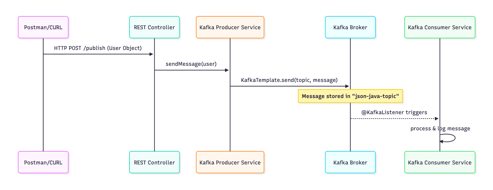

# Spring_Boot-and-Kafka

# Spring Boot & Kafka Integration

A professional implementation of **Apache Kafka** with **Spring Boot**, featuring both simple String and complex JSON message handling.

# Spring Boot & Kafka Integration

A professional implementation of **Apache Kafka** with **Spring Boot**, featuring both simple String and complex JSON message handling.

## 🔄 System Architecture
> **Note:** This diagram renders automatically on GitHub.



⚙️ Local Kafka Setup 
Since this project uses the latest Spring Boot features, follow these steps to run Kafka without Zookeeper:

1. Download & Extract: Get the latest binaries from kafka.apache.org.
2. Navigate to Folder:
   ```cd kafka_2.13-x.x.x```
3. Generate Cluster ID: ```KAFKA_CLUSTER_ID=$(bin/kafka-storage.sh random-uuid)```
4. Format Storage: ```bin/kafka-storage.sh format -t $KAFKA_CLUSTER_ID -c config/kraft/server.properties```
5. Start Server: ```bin/kafka-server-start.sh config/kraft/server.properties```

🏃 Running the Application
1. Clone the Repo: ```git clone git@github.com:mishramayan/Spring_Boot-and-Kafka.git```
2. Build and Run: ```mvn clean install```
  ```mvn spring-boot:run```
